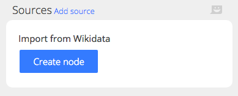

To start importing data, create a source node. When creating the node, you add setup data. After creating the node you will tweak the settings.

### Import from a web API

**Wikidata import** (planned)  
Import data from Wikidata based on a SPARQL query.

---

**Wikimedia Commons import** (planned)  
Import media metadata from Wikimedia Commons.

---

**Flickr import**  
Import media metadata from Flickr. Requires an API key.
- Source > Web API > Flickr import
- Setup: None
- Settings
	- API key
	- Album ID

---

**Internet Archive import**  
Import data from Internet Archive, based on the advanced query.
- Source > Web API > Internet Archive import
- Setup: None
- Settings
	- Search query
	- Records per page
	- Maximum page count

---

**FINNA import**  
Import media metadata from FINNA, the search service to Finnish museums, archives and libraries.
- Source > Web API > Finna query import
- Setup: None
- Settings
	- Search URL
	- Number of pages to retrieve (20 items each)
	- License

---

**Map Warper import**  
Import map metadata (not images) for all maps in a Map Warper instance.
- Source > Web API > MapWarper import
- Setup: Warper instance
- Settings
	- Maximum page count

---

**DSpace 6 collection import**  
Import metadata from DSpace.

---

**DSpace 6 query import**  
Import metadata from DSpace.

---

### Read files

**Online CSV import**  
Import data from an online CSV file.
- Source > Read files > Online CSV import
- Setup: File URL
- Settings
	- Field separator
	- Character encoding
	- (Field names in first row?)
	- (Trim leading and trailing whitespace)
	- (Multiple value separator)
	- Mode
		- Keep data and update based on update key
		- Clear data and re-import
	- Update key
	- (Combine language versions)
	- Authentication
		- Username
		- Password

---

**Local CSV import**  
Upload and import a CSV file.
- Source > Read files > Local CSV import
- Setup: Local filename
- Settings
	- Field separator
	- Character encoding
	- Field names in first row?
	- Trim leading and trailing whitespace
	- Multiple value separator
	- Combine language versions

---

**Import pdf**  
Import text from PDF

---

### Local directory

**Recursive directory scan**  
Recursive directory scan. Only works with local files.

---

### Paste data

**Paste data from the clipboard**  
Paste data from the clipboard (planned)