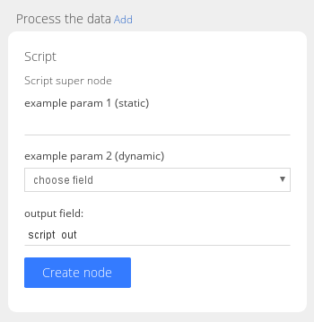

Users interacts with GLAMpipe nodes via parameters and settings.

* The parameter view is displayed to the user when creating a new node.
* The parameter view is defined with plain html in **params.html**.
* Parameters are saved when user creates a new node.
* Parameters **can not be modified** afterwards.
* Parameter values starting with ***in\_*** are input fields.
    * input fields are automatically made visible when node is selected in project view.
* Parameter values starting with ***out\_*** are output fields.
    - output fields are **added** to all documents when node is created.
    - output fields are **deleted** from all documents when node is deleted.
* In select has class **dynamic_field** then it is filled with current collection fields (field selection).

Here is a Script node's param.html

    <label>example param 1 (static)</label>
    <input name="param_1"/>

    <label>example param 2 (dynamic)</label>
    <select name="param_2" class="dynamic_field">
    <option value="">choose field</option>
    </select>

    <label>output field:</label> 
    <input id="process_script_out" name="out_field" value="script_out"/>

So, if you have an input named "prefix" in params view, the value is then later accessible in node scripts via context object like this:

	var pre = context.node.params.prefix;

