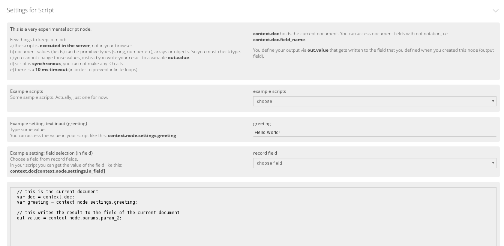

Easiest way to try node development is to experiment with the Script node that is included in GLAMpipe's node set. You can find in from **Process data -> Modify text -> Script**. 

## Node parameters (params.html)
When you create a new node, you first set its parameters. Parameters are **constants** for node meaning that they can't be changed from the GUI or from the script. 

Script node has three parameters, "param_1", "param_2" and "out_field". The firts one is a text field and second allows you to select any field from current collection. 

The third one defines what is the name of field that node adds to all documents and **where the output of the node is stored**. Here the "out\_" part is important. **If node parameter starts with "out\_", it means that GLAMpipe adds that field to all documents when the node is created.** 

In the code you can access parameters through the context object: 

	context.node.params.param_1 

When you want to access actual field value of param_2, you write:

	context.doc[context.node.params.param_2] 

You can see parameters names and their values by clicking "Show node parameters" in the node settings. There are couple of example scripts and some help text provided in the node. Try yourselves!

## Node settings (settings.html)
Node settings are **variable constants** meaning that they can be altered from the GUI (variable) but they are constants from the script's perspective. 

Settings can be also accessed through the context object: 

	context.node.settings.setting_name 

The Script node has two settings: greeting and in_field. And now you can figure out how to access them. Try it out!

## Context object
Context object is "the world" for GLAMpipe's node scripts. The context isolates scripts from the actual Node.js application and **all data input goes through the context object**.   

* **context.doc**

    Contains current record. Properties of the record can be accessed normally. 

    For example, the title of the record: 

        var title = context.doc.title;

* **context.data**

    For API nodes (API source and API lookup) context.data holds the request response. 

* **context.node**

    Contains node object itself (params and settings).

* **context.doc_count**

    Contains total record count.

* **context.count**

    Contains loop counter (i.e. how many records have been processed).

